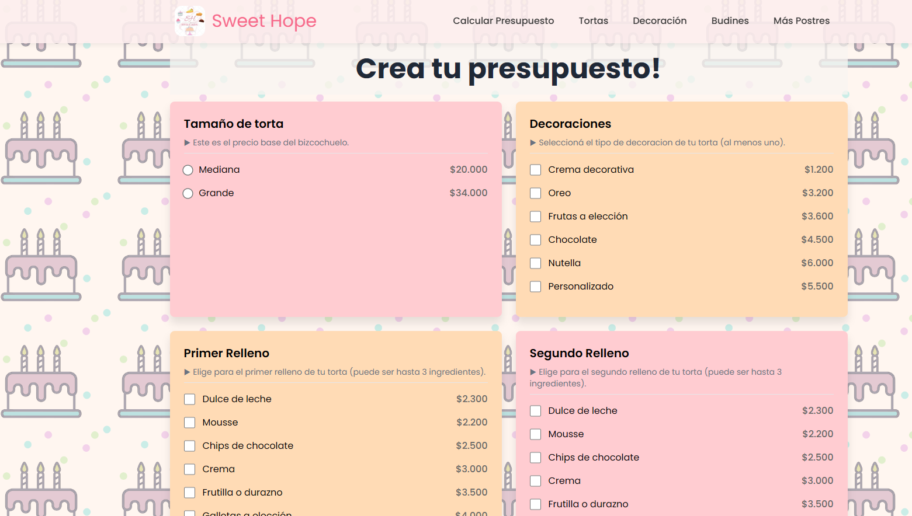
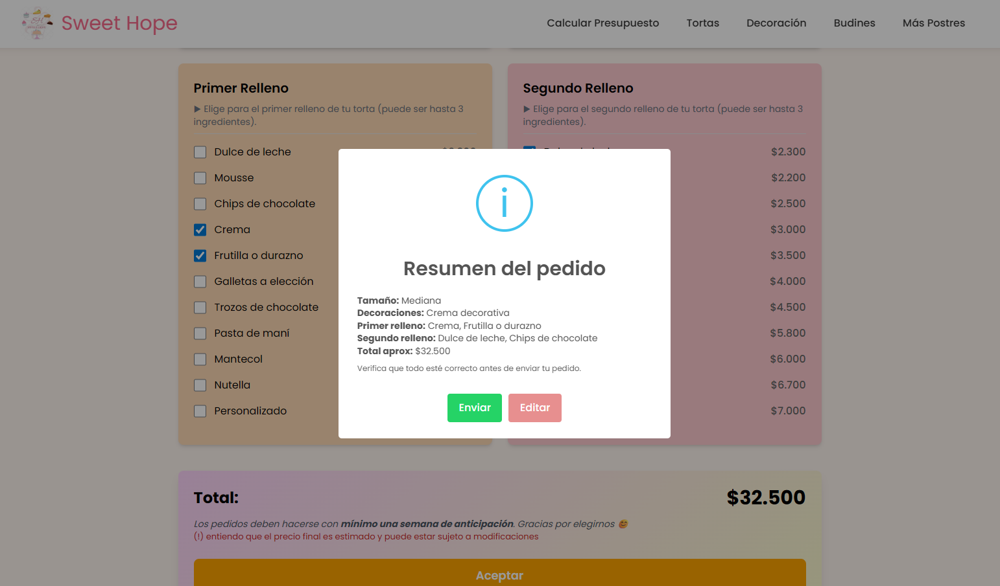

<div align="center">

# 🍰 Sweet Hope


_"El ingrediente secreto es una cucharilla de amor"_


</div>

## ✨ Resumen del Proyecto
Sweet Hope es un sitio estático (disponible momentaneamente en GitHub Pages) que muestra productos mediante carruseles dinámicos, permite calcular el precio estimado de una torta personalizada y enviar el pedido directamente por WhatsApp tras una pre‑visualización. El enfoque principal fue crear un medio facilmente sostenible donde los clientes tuviesen la posibilidad de interactuar y solicitar un pedido fácilmente. Este es un servicio de venta de tortas, decoraciones, postres y más!


Ahora puedes visitar la página [Aquí](https://josuedamacio.github.io/SweetHope/).

<br>

## 🖼️ Capturas

### Ve un carrousel de los productos que hay para ofrecer!


### Explorá las opciones que tenemos para vos


### Una calculadora de precios dinámica


### Tambien cuenta con una pre-visualización de tus elecciones


### Mandá tu solicitud directamente a whatsapp con solo un click


---
<br><br>
## 🧩 Principales Características
- Carruseles de productos generados dinámicamente.
- Datos de productos y precios externos en archivos JSON fáciles de modificar.
- Header reutilizable implementado como **Web Component** (`<site-header>`), usado en varias páginas sin duplicar código.
- Calculadora interactiva de presupuesto con validaciones (tamaño, rellenos, decoraciones) y actualización de precios según las elecciones.
- Pre‑resumen del pedido con **SweetAlert2** antes de abrir WhatsApp.
- Envío del detalle al selector de contacto de WhatsApp.
- Estilos aislados por página cuando es necesario.


## 🛠️ Stack / Tecnologías
| Área | Uso |
|------|-----|
| HTML + CSS | Estructura y estilos base del sitio |
| Web Components | Header reutilizable (`site-header`) |
| JavaScript Vanilla | Lógica de render dinámico y calculadora |
| JSON | Fuente de datos para carruseles y precios (`carrousels.json`, `precios.json`) |
| WhatsApp Link API | Generación del mensaje de pedido |
| Swiper.js | Carruseles responsivos |
| SweetAlert2 | Modales de validación y resumen |
| Tailwind (CDN) | Utilidades rápidas en la sección presupuesto |

## 👍 Arquitectura / Buenas Prácticas Aplicadas
1. **Data‑Driven UI**: Los carruseles y la calculadora no dependen de HTML estático. Se cargan desde JSON → más simple agregar/quitar productos o ajustar precios.
2. **Separación de Responsabilidades**:
	 - `public/data/*.json` contiene solo datos.
	 - `public/scripts/*.js` maneja lógica y DOM.
	 - `public/styles/*.css` estilos modulares (header, bases, página específica).
3. **Reutilización**: El header se mantiene en un único archivo (`header.js`) y se inserta donde haga falta con una etiqueta limpia.
4. **Extensibilidad**: Precios y categorías (por ejemplo futuras "decoraciones exteriores") ya contempladas en estructura JSON aunque no estén activas todavía.
5. **Validaciones UX**: Se previenen acciones incompletas (sin tamaño, sin rellenos, sin decoraciones) antes de permitir el envío.
6. **Mejor Mantenibilidad**: Cambiar un precio ≠ editar múltiples lugares, sólo el JSON.
7. **Accesibilidad básica**: Botón de menú móvil con toggle simple y etiquetas claras (se puede profundizar más a futuro).


## 🔄 Cómo Funciona el Render Dinámico de Productos
1. `index.js` hace `fetch` de `carrousels.json`.
2. Por cada carrusel crea el contenedor y las tarjetas de producto.
3. Inicializa Swiper para cada slider sin hardcodear clases manualmente.
4. Para agregar un nuevo carrusel sólo sumás un bloque al JSON.

## 💰 Calculadora de Presupuesto
- Carga `precios.json` al iniciar.
- Ajusta precios mostrados según multiplicador del tamaño.
- Limita a 3 ingredientes por relleno para evitar combos ilógicos.
- Genera un mensaje formateado y abre WhatsApp permitiendo elegir el contacto.
- Muestra un resumen previo (confirmar / editar) usando SweetAlert2.

## 📝 Editar Datos (Ejemplos)
Agregar un nuevo topping / decoración:
```
public/data/precios.json
{
	"toppings": {
		"chocolate": 800,
		"frutilla_fresca": 900,
		"nuevo_topping": 750
	}
}
```
Al recargar se verá sin tocar el HTML.

Agregar un producto a un carrusel:
```
public/data/carrousels.json
{
	"carrousels": [
		{
			"title": "Tortas",
			"items": [
				{ "name": "Choco Torta", "image": "img/tortas/choco_torta.jpg" },
				{ "name": "Nueva Torta", "image": "img/tortas/nueva.jpg" }
			]
		}
	]
}
```